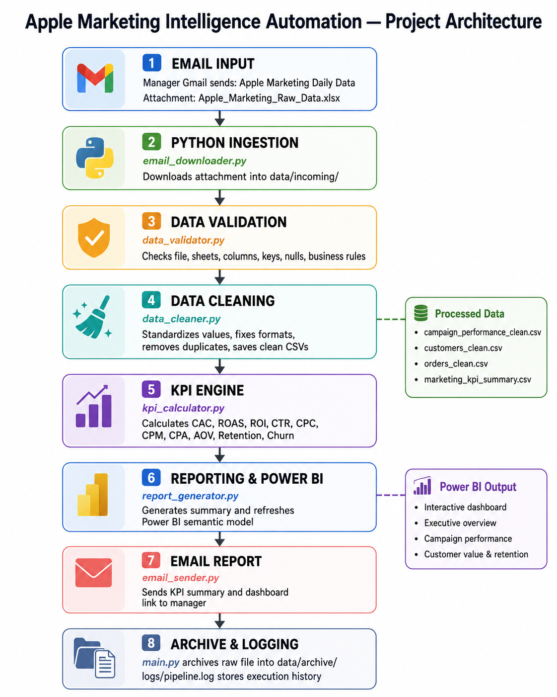
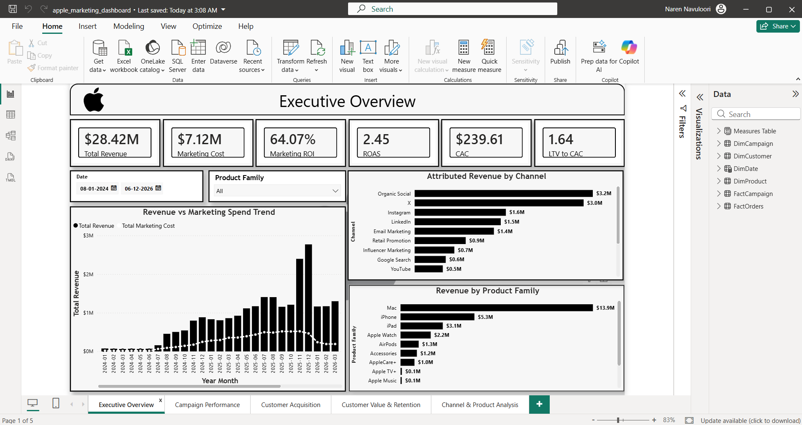
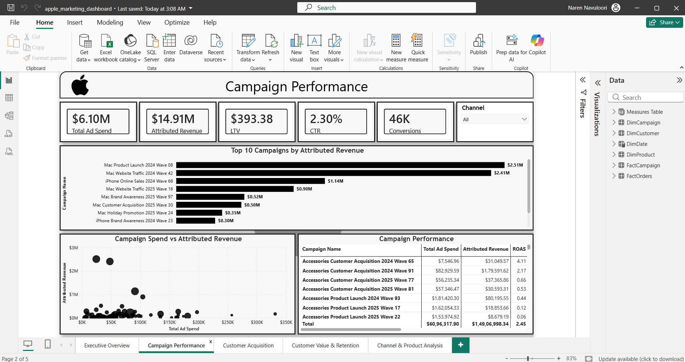
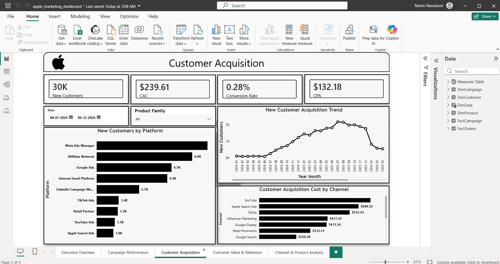
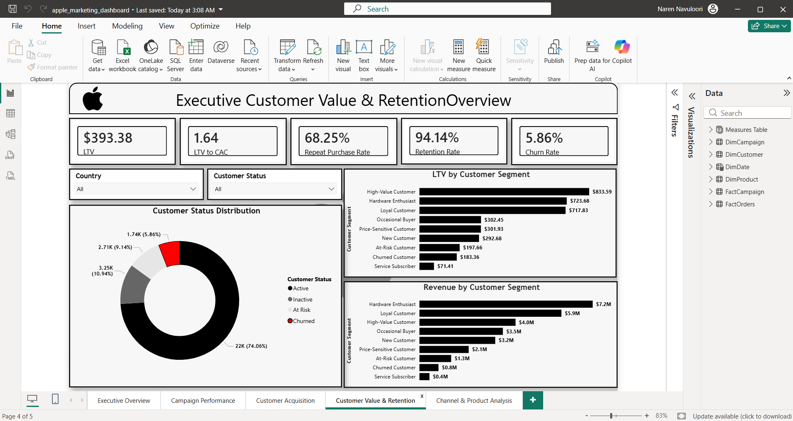
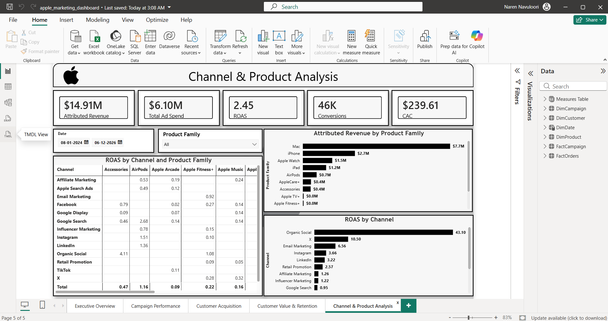

# Apple Marketing Intelligence Automation

> **End-to-end automated marketing analytics pipeline that ingests daily Excel data from email, validates and cleans it with Python, calculates marketing KPIs, refreshes Power BI automatically, emails the report to stakeholders, logs every step, and archives the processed raw file.**

<p align="center">
  
</p>

---

## Project Overview

**Apple Marketing Intelligence Automation** is a recruiter-focused end-to-end analytics automation project designed to simulate a real marketing reporting workflow.

A manager sends a daily marketing Excel workbook by email. The pipeline automatically downloads the attachment, validates data quality, cleans and standardizes the data, calculates marketing KPIs, refreshes the Power BI semantic model, emails the reporting summary to the stakeholder, logs the execution, and archives the processed raw file.

The entire workflow is orchestrated through `main.py` and scheduled with **Windows Task Scheduler**, removing the need for manual daily execution.

---

## Business Problem

Marketing reporting often requires repetitive manual work:

- Downloading files from email
- Checking whether the data is valid
- Cleaning inconsistent values and formats
- Recalculating marketing KPIs
- Updating Power BI reports
- Sending reports to stakeholders
- Maintaining historical raw files
- Tracking pipeline failures and execution history

This process is time-consuming, error-prone, and difficult to scale.

### Goal

Build a simple but realistic automated reporting system that can run daily with minimal manual intervention.

---

## Solution

The solution automates the full reporting lifecycle:

```text
Manager Email
     ↓
Email Ingestion
     ↓
Data Validation
     ↓
Data Cleaning
     ↓
KPI Calculation
     ↓
Power BI Refresh
     ↓
Email Report
     ↓
Archive + Logging
```

The pipeline stops immediately when a critical step fails, preventing invalid data from reaching downstream reporting.

---

## Project Architecture

<p align="center">
  
</p>

### High-Level Flow

1. Manager sends `Apple_Marketing_Raw_Data.xlsx`
2. `email_downloader.py` downloads the latest valid unread attachment
3. `data_validator.py` checks structure and data quality
4. `data_cleaner.py` cleans and standardizes the raw data
5. `kpi_calculator.py` calculates marketing KPIs
6. `report_generator.py` creates the reporting summary and refreshes Power BI
7. `email_sender.py` sends the KPI summary and dashboard link
8. `main.py` archives the raw file and controls the full workflow
9. `logs/pipeline.log` records execution history

---

## Technology Stack

| Area | Technology |
|---|---|
| Programming | Python |
| Data Processing | pandas, NumPy |
| Excel Processing | openpyxl |
| Authentication | Microsoft Entra ID, MSAL, OAuth 2.0 |
| Email Automation | Microsoft Graph API |
| BI & Visualization | Microsoft Power BI |
| BI Automation | Power BI REST API |
| Configuration | python-dotenv |
| Scheduling | Windows Task Scheduler |
| Version Control | Git, GitHub |
| File Format | Excel, CSV |

---

## Dataset

The project uses a realistic synthetic Apple marketing dataset covering approximately:

| Dataset | Raw Rows | Clean Rows |
|---|---:|---:|
| Campaign Performance | 36,000 | 35,640 |
| Customers | 30,000 | 29,700 |
| Orders | 100,000 | 98,802 |

### Main Raw Sheets

- `Campaign_Performance_Raw`
- `Customers_Raw`
- `Orders_Raw`

### Reporting Period

`2024-07-04` to `2026-06-30`

The dataset intentionally includes realistic data-quality issues such as duplicates, nulls, inconsistent text values, mixed date formats, invalid relationships, and business-rule anomalies so the pipeline can demonstrate real validation and cleaning logic.

For field definitions, see:

- [`docs/data_dictionary.md`](docs/data_dictionary.md)
- [`docs/kpi_dictionary.md`](docs/kpi_dictionary.md)

---

## Automation Workflow

### 1. Email Ingestion

`src/email_downloader.py`

- Connects to Outlook/Hotmail using Microsoft Graph
- Searches for the latest unread manager email
- Verifies the expected sender
- Verifies the exact subject
- Verifies the expected attachment filename
- Downloads the workbook into `data/incoming/`
- Marks the processed source email as read
- Logs the download

Expected source email:

```text
Subject: Apple Marketing Daily Data
Attachment: Apple_Marketing_Raw_Data.xlsx
```

---

### 2. Data Validation

`src/data_validator.py`

The validator checks:

- Raw file exists
- File is not empty
- Workbook can be opened
- Required sheets exist
- Required columns exist
- Primary keys
- Duplicate keys
- Missing values
- Business-rule anomalies
- Foreign-key integrity
- Revenue and profit formula consistency

Critical structural failures stop the pipeline before cleaning or reporting.

---

### 3. Data Cleaning

`src/data_cleaner.py`

The cleaning layer:

- Removes exact duplicates
- Removes remaining duplicate primary-key rows
- Standardizes text categories
- Cleans dates
- Cleans numeric and currency fields
- Standardizes Boolean values
- Handles missing values
- Removes invalid customer references
- Clears invalid campaign references
- Repairs controlled data-quality issues

Processed outputs:

```text
data/processed/
├── campaign_performance_clean.csv
├── customers_clean.csv
└── orders_clean.csv
```

---

## Marketing KPIs

`src/kpi_calculator.py`

The project covers the following major marketing and customer metrics:

| KPI | Purpose |
|---|---|
| CAC | Measures customer acquisition efficiency |
| LTV | Estimates customer value |
| LTV:CAC | Evaluates acquisition sustainability |
| ROAS | Measures advertising return |
| Marketing ROI | Measures profitability of marketing investment |
| CTR | Measures ad engagement |
| CPC | Measures cost per click |
| CPM | Measures cost per 1,000 impressions |
| CPA | Measures cost per conversion |
| Conversion Rate | Measures funnel effectiveness |
| AOV | Measures average transaction value |
| Retention Rate | Measures customer retention |
| Churn Rate | Measures customer loss |
| Repeat Purchase Rate | Measures repeat customer behavior |
| Gross Margin | Measures profitability after COGS |

Example overall KPI results from the processed dataset:

| KPI | Result |
|---|---:|
| Total Marketing Cost | $7,116,394.51 |
| New Customers | 29,700 |
| CAC | $239.61 |
| CTR | 2.30% |
| CPC | $0.37 |
| CPM | $8.46 |
| Conversion Rate | 0.28% |
| CPA | $132.18 |

Detailed definitions and formulas are available in [`docs/kpi_dictionary.md`](docs/kpi_dictionary.md).

---

## Power BI Data Model

The Power BI model follows a simple star-style analytical structure.

### Main Tables

- `FactCampaign`
- `FactOrders`
- `DimCustomer`
- `DimCampaign`
- `DimDate`
- `DimProduct`
- `_Measures`

### Core Relationships

```text
DimCustomer  1 ───── * FactOrders
DimCampaign  1 ───── * FactCampaign
DimCampaign  1 ───── * FactOrders
DimDate      1 ───── * FactCampaign
DimDate      1 ───── * FactOrders
DimProduct   1 ───── * FactCampaign
DimProduct   1 ───── * FactOrders
```

Relationships are single-direction, active, and designed to avoid unnecessary fact-to-fact relationships.

---

## Dashboard

The Power BI report contains five business-focused pages:

1. **Executive Overview**
2. **Campaign Performance**
3. **Customer Acquisition**
4. **Customer Value & Retention**
5. **Channel & Product Analysis**

The dashboard uses dynamic DAX measures so filters and slicers recalculate metrics correctly.

---

## Dashboard Screenshots

### Executive Overview

<p align="center">
  
</p>

### Campaign Performance

<p align="center">
  
</p>

### Customer Acquisition

<p align="center">
  
</p>

### Customer Value & Retention

<p align="center">
  
</p>

### Channel & Product Analysis

<p align="center">
  
</p>

---

## Automation & Scheduling

The complete pipeline is controlled by:

```text
main.py
```

and scheduled through **Windows Task Scheduler**.

Example:

```text
Every Day
8:00 AM
   ↓
Task Scheduler
   ↓
venv\Scripts\python.exe
   ↓
main.py
```

This removes the need to manually run:

```bash
python main.py
```

### Automated Power BI Refresh

`report_generator.py`:

1. Authenticates using a Microsoft Entra service principal
2. Sends a Power BI REST API refresh request
3. Tracks the new `ViaApi` refresh
4. Waits until the refresh reaches `Completed`
5. Allows the pipeline to continue only after success

### Automated Report Email

After the Power BI refresh succeeds, `email_sender.py` sends:

- Daily KPI summary
- `marketing_kpi_summary.csv`
- Power BI dashboard link

through Microsoft Graph.

---

## Logging & Auditability

All important pipeline events are recorded in:

```text
logs/pipeline.log
```

Typical execution history:

```text
Pipeline started
Email attachment downloaded
Dataset validated
Data cleaning completed
KPI calculation completed
Power BI refresh requested
Power BI refresh completed
Report email sent
Raw file archived
Pipeline completed successfully
```

This provides:

- Monitoring
- Auditability
- Debugging
- Execution traceability

---

## Raw File Archiving

After the complete pipeline succeeds, the source workbook is moved from:

```text
data/incoming/
```

to:

```text
data/archive/
```

with a timestamped filename, for example:

```text
Apple_Marketing_Raw_Data_20260811_210219.xlsx
```

The raw file is archived **only after the full workflow succeeds**, preventing incomplete runs from being marked as successfully processed.

---

## Repository Structure

```text
apple-marketing-intelligence-automation/
│
├── data/
│   ├── incoming/
│   ├── processed/
│   └── archive/
│
├── src/
│   ├── email_downloader.py
│   ├── data_validator.py
│   ├── data_cleaner.py
│   ├── kpi_calculator.py
│   ├── report_generator.py
│   └── email_sender.py
│
├── power-bi/
│   ├── apple_marketing_dashboard.pbix
│   └── screenshots/
│       ├── 01_executive_overview.png
│       ├── 02_campaign_performance.png
│       ├── 03_customer_acquisition.png
│       ├── 04_customer_value_retention.png
│       └── 05_channel_product_analysis.png
│
├── config/
│   └── config.py
│
├── logs/
│   └── pipeline.log
│
├── docs/
│   ├── project_architecture.png
│   ├── data_dictionary.md
│   └── kpi_dictionary.md
│
├── main.py
├── requirements.txt
├── .env.example
├── .gitignore
└── README.md
```

---

## How to Run

### 1. Clone the repository

```bash
git clone <your-repository-url>
cd apple-marketing-intelligence-automation
```

### 2. Create a virtual environment

```bash
python -m venv venv
```

### 3. Activate it on Windows

```powershell
venv\Scripts\Activate
```

### 4. Install dependencies

```bash
pip install -r requirements.txt
```

### 5. Create your local environment file

Copy:

```text
.env.example
```

to:

```text
.env
```

Then configure your own:

- Email account settings
- Microsoft Entra application IDs
- Power BI workspace ID
- Power BI semantic model ID
- Power BI dashboard URL

> Never commit `.env`, access tokens, passwords, or client secrets to GitHub.

### 6. Run the pipeline

```bash
python main.py
```

### 7. Optional: schedule it

Configure Windows Task Scheduler to run the project's virtual-environment Python executable with `main.py` on the required schedule.

---

## Key Business Insights

From the current processed synthetic dataset:

- The pipeline identified **29,700 new customers** across the reporting period.
- Overall **Customer Acquisition Cost is $239.61**.
- Overall **CTR is 2.30%**, showing the proportion of impressions that generated clicks.
- **CPC is $0.37**, indicating relatively low traffic acquisition cost within the synthetic campaign data.
- **CPM is $8.46**, providing a useful benchmark for awareness efficiency.
- The overall **conversion rate is 0.28%**, showing significant opportunity between click and conversion stages.
- **CPA is $132.18**, providing a direct benchmark for conversion acquisition efficiency.
- Channel, campaign, product, acquisition, retention, and customer value performance can be explored interactively in Power BI.

> These findings are derived from a synthetic portfolio dataset and are intended to demonstrate analytical methodology rather than represent real Apple business performance.

---

## Skills Demonstrated

### Data Analytics
- Marketing analytics
- KPI design and interpretation
- Customer acquisition analysis
- Retention and churn analysis
- Profitability analysis
- Data modeling
- DAX
- Power Query
- Dashboard design

### Python
- pandas data processing
- Excel automation
- Modular Python project structure
- Data validation
- Data cleaning
- KPI calculation
- Exception handling
- Logging
- File management

### Automation & Integration
- Microsoft Graph API
- OAuth 2.0 authentication
- Microsoft Entra ID
- Power BI REST API
- Power BI semantic-model refresh monitoring
- Automated email ingestion
- Automated report delivery
- Windows Task Scheduler
- End-to-end pipeline orchestration

### Engineering Practices
- Environment-variable configuration
- Separation of concerns
- Reusable modules
- Audit logging
- Data-quality controls
- Raw-file archiving
- Git/GitHub project organization

---

## Why This Project Matters

This project demonstrates more than dashboard creation.

It shows how a data analyst can automate the complete reporting lifecycle:

```text
Data Arrival
   ↓
Quality Control
   ↓
Transformation
   ↓
Business Metrics
   ↓
BI Reporting
   ↓
Stakeholder Delivery
   ↓
Monitoring & Archiving
```

The result is a practical example of how Python, APIs, Power BI, and automation can work together to reduce repetitive reporting effort and improve reporting reliability.

---

## Disclaimer

This is an **independent portfolio project** created for educational and demonstration purposes.

- The dataset is synthetic.
- The project is not affiliated with, endorsed by, or sponsored by Apple Inc.
- Apple names and product references are used only to simulate a realistic marketing analytics business scenario.
- No confidential or proprietary Apple data is used.
- KPI results shown in this repository should not be interpreted as actual Apple performance.
